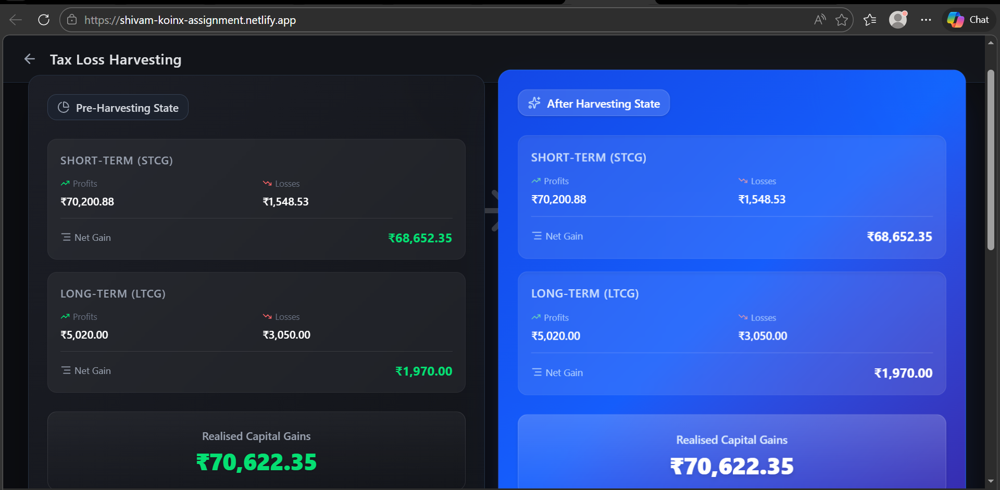
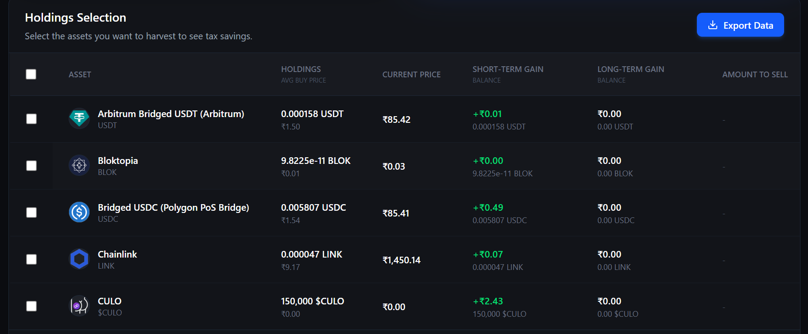

# Tax Loss Harvesting Tool

🚀 **Live Deployment:** [https://shivam-koinx-assignment.netlify.app/](https://shivam-koinx-assignment.netlify.app/)

A responsive React-based Tax Loss Harvesting interface simulating mock APIs and dynamic capital gains calculations.

## Features
- **Accurate Business Logic:** Calculates new capital gains positions and potential tax savings.
- **Dynamic Post-Harvesting Calculations:** Instantly updates metrics when crypto holdings are selected to be harvested.
- **Responsive Layout:** Adjusts to any screen size, meeting the criteria for a premium, modern design.
- **Tailwind CSS v4:** Uses the latest release for atomic class generation.

## Screenshots

### Pre-Harvesting View

<div align="center">
  
  <br/><br/>
  
</div>


## Setup Instructions

1. Clone the repository and navigate into the project directory.
2. Install the dependencies:
   ```bash
   npm install
   ```
3. Start the development server:
   ```bash
   npm run dev
   ```
4. Build for production (Optional):
   ```bash
   npm run build
   ```

## Assumptions
- Uses an in-memory artificial delay (`setTimeout`) to simulate exact network latency of real API hits.
- Implements absolute negative values for loss accumulation according to Standard Accounting Practices (and the assignment instructions).

## Technologies Used
- React (Vite template)
- TypeScript
- Tailwind CSS v4
- Lucide React (for icons)
